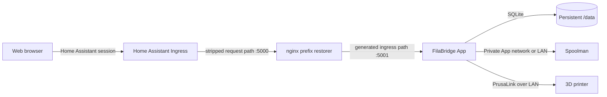

# FilaBridge for Home Assistant

[](https://github.com/nebhale/ha-filabridge/releases)
[](https://github.com/nebhale/ha-filabridge/actions/workflows/lint.yaml)
[](https://github.com/nebhale/ha-filabridge/actions/workflows/publish.yaml)
[](filabridge/config.yaml)
[](LICENSE)

Run [FilaBridge](https://github.com/sargonas/filabridge) as a managed Home Assistant App. FilaBridge connects PrusaLink-compatible printers to [Spoolman](https://github.com/Donkie/Spoolman), tracks which spool is loaded on each toolhead, and records filament consumption when prints finish.

This repository publishes a thin, multi-architecture Home Assistant wrapper as `ghcr.io/nebhale/ha-filabridge`. The current prerelease builds on `ghcr.io/nebhale/filabridge:1.3.1-pr.51` from [FilaBridge PR #51](https://github.com/sargonas/filabridge/pull/51) and adds native Home Assistant Ingress using the same prefix-restoring proxy design as the Spoolman-Ingress App.

## What you get

- Automatic startup and lifecycle management through Home Assistant Supervisor.
- Native `amd64` and `aarch64` support, including Raspberry Pi 5.
- Persistent FilaBridge configuration, toolhead mappings, and print history under the App's `/data` directory.
- Cold backups so FilaBridge's SQLite database is stopped before Home Assistant snapshots it.
- Native Home Assistant Ingress with an optional FilaBridge sidebar entry.
- No FilaBridge Web UI port exposed on the Home Assistant host.
- Runtime discovery of Supervisor's generated ingress path for PR #51 testing.
- Prebuilt, versioned wrapper images from GHCR for fast and repeatable installs.
- Automatic App updates when a stable upstream FilaBridge release and both supported images are available.
- A matching Git commit, annotated tag, and GitHub Release for every automated version update.

## Architecture



FilaBridge can use any reachable Spoolman server. When both are Home Assistant Apps, they can communicate over Supervisor's private App network without exposing Spoolman to the rest of the LAN.

## Prerequisites

- Home Assistant OS or another supervised Home Assistant installation that supports Apps.
- A Spoolman server reachable from the FilaBridge App.
- A PrusaLink-compatible printer with PrusaLink enabled and its password/API key available.

FilaBridge also contains experimental Bambu support. See the [upstream project](https://github.com/sargonas/filabridge) for its current status and requirements.

## Installation

1. In Home Assistant, open **Settings → Apps → App store**.
2. Open the overflow menu, choose **Repositories**, and add:

   ```text
   https://github.com/nebhale/ha-filabridge
   ```

3. Find **FilaBridge** in the App store and select **Install**.
4. Start the App and optionally enable **Start on boot** and **Show in sidebar**.
5. Select **Open Web UI** and complete FilaBridge's first-run configuration.

There are no options on the Home Assistant **Configuration** tab. That is intentional: FilaBridge manages its own settings in the Web UI and persists them in its SQLite database.

## First-run configuration

FilaBridge will ask for a Spoolman URL and printer connection details. If you installed Bytenoodle's **Spoolman-Ingress** App from its usual repository, its internal URL is commonly:

```text
http://2c829f0e-spoolman-ingress:7912
```

The `2c829f0e` repository identifier is derived from Bytenoodle's repository URL. If your Spoolman App came from another repository, use that repository's identifier and the App's slug. If Spoolman runs elsewhere, use its normal LAN URL instead.

For each printer, enter its LAN address, PrusaLink password/API key, and toolhead count. FilaBridge applies configuration changes immediately without restarting the App.

## Security

> [!WARNING]
> FilaBridge has no built-in authentication. This App therefore exposes its Web UI only through Home Assistant Ingress, where access requires a Home Assistant session. Do not modify the wrapper to publish its internal ports directly to an untrusted network.

At startup, the wrapper uses its Supervisor token to read the App's unique generated ingress URL. nginx accepts Supervisor's prefix-stripped requests on port 5000, restores that generated path, and forwards them to FilaBridge on the container-only port 5001. FilaBridge receives the same base path it uses to generate links, API routes, static assets, and WebSocket URLs.

nginx accepts ingress traffic only from Supervisor and accepts localhost traffic for the inherited container health check.

## Persistence, backups, and restores

The App sets `FILABRIDGE_DB_PATH=/data`. All FilaBridge state therefore lives in Supervisor-managed persistent App storage rather than the upstream image's default `/app/data` directory.

FilaBridge uses SQLite in WAL mode. The App declares `backup: cold`, so Supervisor stops it before capturing a backup and restarts it afterward. This produces a clean database snapshot containing configuration, printers, mappings, in-flight print state, and history.

Restoring the App's data from a Home Assistant backup restores that database. FilaBridge applies any required database migrations automatically when the restored App starts.

## Health and updates

The inherited container health check requests:

```text
http://127.0.0.1:5000/healthz
```

During normal ingress operation that request reaches nginx and is forwarded to FilaBridge on port 5001 with the generated prefix restored. If Supervisor metadata is unavailable, the wrapper falls back to running FilaBridge directly on port 5000 for diagnostics.

The App version always matches its published wrapper-image tag. Wrapper version `1.3.1-pr51-2` uses `ghcr.io/nebhale/filabridge:1.3.1-pr.51`, the public fork image built from FilaBridge PR #51. While a prerelease version is configured, the hourly workflow validates the current manifest but intentionally skips stable upstream synchronization so the test image is not replaced during evaluation.

For normal stable versions, the workflow checks the latest stable FilaBridge release, verifies that the corresponding GHCR image contains both `linux/amd64` and `linux/arm64`, validates the App manifest, and then advances the version.

When a newer stable upstream version is available, the workflow creates:

1. A commit named `Update FilaBridge to <version>`.
2. An annotated `v<version>` tag pointing to that exact commit.
3. Published `amd64` and `aarch64` wrapper images and a multi-architecture manifest.
4. A GitHub Release created only after the image is available.

The update workflow pushes the commit and annotated tag atomically. The tag starts the publishing workflow, which verifies that the tag matches `config.yaml`, builds both architectures, publishes `ghcr.io/nebhale/ha-filabridge:<version>`, and then creates the GitHub Release. Runs where the upstream version has not changed do not inspect or modify existing tags and releases. Wrapper changes that affect the published image require a new App version and tag; published tags are never moved.

Dependabot separately keeps the GitHub Actions used by this repository current.

## Troubleshooting

### The repository does not appear in the App store

- Confirm the repository URL is exactly `https://github.com/nebhale/ha-filabridge`.
- Refresh the App store after adding it.
- Verify that your installation includes Home Assistant Supervisor; Home Assistant Container installations do not support Apps.

### The App will not install

- Confirm the host architecture is `amd64` or `aarch64`.
- Check Supervisor logs for an image-pull error.
- Confirm the App version exists in the public [`ha-filabridge` package](https://github.com/users/nebhale/packages/container/package/ha-filabridge).
- Confirm its FilaBridge base image exists in the public [`filabridge` package](https://github.com/users/nebhale/packages/container/package/filabridge).

### The Web UI does not open

- Check that the App is running and review its log.
- Confirm the log reports an ingress URL and a successful nginx start.
- Reload the FilaBridge sidebar entry or use **Open Web UI** from the App page.
- Restart the App if its generated ingress URL changed after a restore.

### FilaBridge cannot reach Spoolman

- Recheck the URL in FilaBridge's Web UI.
- If using a Home Assistant App hostname, verify its repository identifier and slug.
- Use the regular LAN URL when Spoolman is not on Supervisor's internal App network.

### FilaBridge cannot reach the printer

- Confirm PrusaLink is enabled.
- Use the printer's LAN address, not a cloud URL.
- Recheck the PrusaLink password/API key.
- Confirm the Home Assistant host can route to the printer's VLAN or subnet.

### Filament usage is not recorded

- Map a Spoolman spool to each active toolhead.
- Review FilaBridge's dashboard warnings and App logs.
- Confirm the print metadata includes filament usage information.

## Development and maintenance

The App Dockerfile builds a small wrapper around the selected FilaBridge image. It installs nginx, `curl`, and `jq`; the FilaBridge application itself remains supplied by the selected upstream or test image. Every version tag builds and publishes both supported architectures through Home Assistant's official builder actions. Supervisor pulls the resulting multi-architecture image instead of building it on the Home Assistant host.

Pull requests and pushes run the Home Assistant App linter. A daily lint run detects compatibility problems introduced by evolving App validation rules.

The update workflow can also be started manually from the repository's **Actions** tab. It requires GitHub Actions **Read and write permissions** and permission to push commits and tags to `main`. Prerelease App versions are treated as deliberate test pins and are not replaced by this workflow.

## Support and attribution

- Problems with this Home Assistant packaging or its automation: [open an issue here](https://github.com/nebhale/ha-filabridge/issues).
- Problems with FilaBridge behavior: use the [upstream FilaBridge issue tracker](https://github.com/sargonas/filabridge/issues).
- Problems with Spoolman: use the [Spoolman project](https://github.com/Donkie/Spoolman).

This packaging repository is licensed under [Apache License 2.0](LICENSE). FilaBridge is a separate GPL-3.0 project distributed by its upstream maintainers. The published wrapper image contains that upstream application together with this repository's Home Assistant ingress packaging.
