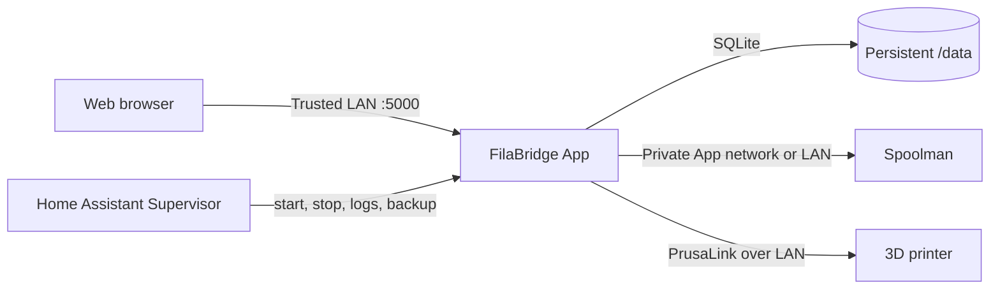

# FilaBridge for Home Assistant

[](https://github.com/nebhale/ha-filabridge/releases)
[](https://github.com/nebhale/ha-filabridge/actions/workflows/lint.yaml)
[](filabridge/config.yaml)
[](LICENSE)

Run [FilaBridge](https://github.com/sargonas/filabridge) as a managed Home Assistant App. FilaBridge connects PrusaLink-compatible printers to [Spoolman](https://github.com/Donkie/Spoolman), tracks which spool is loaded on each toolhead, and records filament consumption when prints finish.

This repository is the Home Assistant packaging, not a fork of FilaBridge. Home Assistant Supervisor pulls the official, multi-architecture `ghcr.io/sargonas/filabridge` image and supplies lifecycle management, persistent storage, backups, logs, and a convenient **Open Web UI** action. No derivative image is built or republished here.

## What you get

- Automatic startup and lifecycle management through Home Assistant Supervisor.
- Native `amd64` and `aarch64` support, including Raspberry Pi 5.
- Persistent FilaBridge configuration, toolhead mappings, and print history under the App's `/data` directory.
- Cold backups so FilaBridge's SQLite database is stopped before Home Assistant snapshots it.
- A direct Web UI link on port 5000.
- Automatic App updates when a stable upstream FilaBridge release and both supported images are available.
- A matching Git commit, annotated tag, and GitHub Release for every automated version update.

## Architecture



FilaBridge can use any reachable Spoolman server. When both are Home Assistant Apps, they can communicate over Supervisor's private App network without exposing Spoolman to the rest of the LAN.

## Prerequisites

- Home Assistant OS or another supervised Home Assistant installation that supports Apps.
- A Spoolman server reachable from the FilaBridge App.
- A PrusaLink-compatible printer with PrusaLink enabled and its password/API key available.
- A free TCP port on the Home Assistant host; this App uses port 5000 by default.

FilaBridge also contains experimental Bambu support. See the [upstream project](https://github.com/sargonas/filabridge) for its current status and requirements.

## Installation

1. In Home Assistant, open **Settings → Apps → App store**.
2. Open the overflow menu, choose **Repositories**, and add:

   ```text
   https://github.com/nebhale/ha-filabridge
   ```

3. Find **FilaBridge** in the App store and select **Install**.
4. If port 5000 is already in use, choose another host port on the App's **Network** tab.
5. Start the App and optionally enable **Start on boot** in Home Assistant.
6. Select **Open Web UI** and complete FilaBridge's first-run configuration.

There are no options on the Home Assistant **Configuration** tab. That is intentional: FilaBridge manages its own settings in the Web UI and persists them in its SQLite database.

## First-run configuration

FilaBridge will ask for a Spoolman URL and printer connection details. If you installed Bytenoodle's **Spoolman-Ingress** App from its usual repository, its internal URL is commonly:

```text
http://2c829f0e-spoolman-ingress:7912
```

The `2c829f0e` repository identifier is derived from Bytenoodle's repository URL. If your Spoolman App came from another repository, use that repository's identifier and the App's slug. If Spoolman runs elsewhere, use its normal LAN URL instead.

For each printer, enter its LAN address, PrusaLink password/API key, and toolhead count. FilaBridge applies configuration changes immediately without restarting the App.

## Security

> [!WARNING]
> FilaBridge has no built-in authentication. Anyone who can reach its Web UI can change printer, Spoolman, and webhook settings. Keep port 5000 on a trusted LAN and do not expose it directly to the internet.

For remote access, use a VPN or an authenticating reverse proxy. Home Assistant Ingress is intentionally not enabled in this initial wrapper because FilaBridge currently uses root-relative static, API, and WebSocket routes that require dedicated compatibility testing behind a path-prefixed proxy.

## Persistence, backups, and restores

The App sets `FILABRIDGE_DB_PATH=/data`. All FilaBridge state therefore lives in Supervisor-managed persistent App storage rather than the upstream image's default `/app/data` directory.

FilaBridge uses SQLite in WAL mode. The App declares `backup: cold`, so Supervisor stops it before capturing a backup and restarts it afterward. This produces a clean database snapshot containing configuration, printers, mappings, in-flight print state, and history.

Restoring the App's data from a Home Assistant backup restores that database. FilaBridge applies any required database migrations automatically when the restored App starts.

## Health and updates

The upstream image includes a container health check against:

```text
http://127.0.0.1:5000/healthz
```

The App version always matches the upstream container tag. An hourly workflow checks the latest stable FilaBridge release, verifies that the corresponding GHCR image contains both `linux/amd64` and `linux/arm64`, validates the App manifest, and then advances the version.

Every automated update creates:

1. A commit named `Update FilaBridge to <version>`.
2. An annotated `v<version>` tag pointing to that exact commit.
3. A published GitHub Release linking to the upstream release and image.

The process is idempotent. A later run recreates a missing tag or release but refuses to move a tag that points at a different commit. Dependabot separately keeps the GitHub Actions used by this repository current.

## Troubleshooting

### The repository does not appear in the App store

- Confirm the repository URL is exactly `https://github.com/nebhale/ha-filabridge`.
- Refresh the App store after adding it.
- Verify that your installation includes Home Assistant Supervisor; Home Assistant Container installations do not support Apps.

### The App will not install

- Confirm the host architecture is `amd64` or `aarch64`.
- Check Supervisor logs for an image-pull error.
- Confirm the release's matching image tag exists in [upstream GHCR](https://github.com/sargonas/filabridge/pkgs/container/filabridge).

### The Web UI does not open

- Check that the App is running and review its log.
- Check the **Network** tab for the selected host port.
- Resolve any conflict with another service using port 5000.
- Make sure a firewall is not blocking the selected port on your trusted LAN.

### FilaBridge cannot reach Spoolman

- Recheck the URL in FilaBridge's Web UI.
- If using a Home Assistant App hostname, verify its repository identifier and slug.
- Use the regular LAN URL when Spoolman is not on Supervisor's internal App network.

### FilaBridge cannot reach the printer

- Confirm PrusaLink is enabled.
- Use the printer's LAN address, not a cloud URL.
- Recheck the PrusaLink password/API key.
- Confirm the Home Assistant host can route to the printer's VLAN or subnet.

### Filament usage is not recorded

- Map a Spoolman spool to each active toolhead.
- Review FilaBridge's dashboard warnings and App logs.
- Confirm the print metadata includes filament usage information.

## Development and maintenance

The repository contains no Dockerfile and performs no container build. Pull requests and pushes run the Home Assistant App linter. A daily lint run detects compatibility problems introduced by evolving App validation rules.

The update workflow can also be started manually from the repository's **Actions** tab. It requires GitHub Actions **Read and write permissions** and permission to push commits and tags to `main`.

## Support and attribution

- Problems with this Home Assistant packaging or its automation: [open an issue here](https://github.com/nebhale/ha-filabridge/issues).
- Problems with FilaBridge behavior: use the [upstream FilaBridge issue tracker](https://github.com/sargonas/filabridge/issues).
- Problems with Spoolman: use the [Spoolman project](https://github.com/Donkie/Spoolman).

This packaging repository is licensed under [Apache License 2.0](LICENSE). FilaBridge is a separate GPL-3.0 project distributed by its upstream maintainers. Installing this App causes Supervisor to download the upstream image directly; this repository does not redistribute it.
